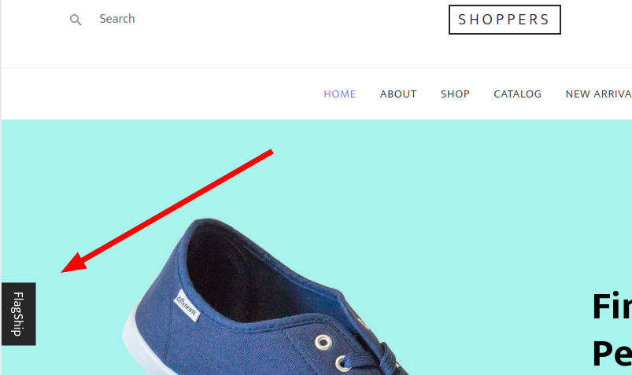
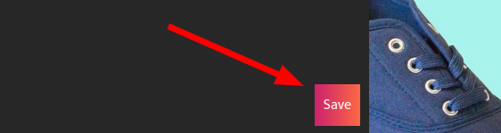
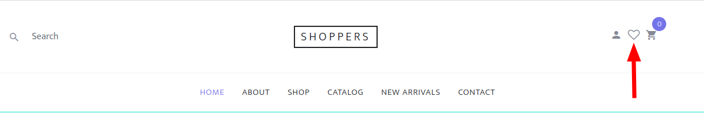
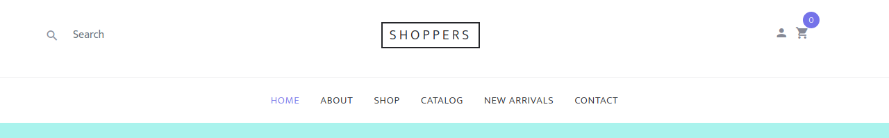

<p align="center">


</p>

# Sample of React app illustrating ecommerce website using [Flagship - React SDK](../../README.md)

## Online demo

<ul style="line-height:1.4;"><li><a href='#'>👉click here ! 😎</a></li></ul>

## What can i do to play with Flagship ?

1. Click on the "Flagship" button localized middle left of the page.

    <div style='max-width: 400px;'>

    

    </div>

2. We already set a campaign on a Flagship Demo Account. Complete the form so that SDK will start with those settings:

    Visitor ID = `TYPE_ANYTHING`

    Env ID = `blhsrbjggr132j03r630`

    Click "Add context" and put:

    - key = `isBetaUser`

    - type = `Boolean`
    - value = `true`

    The campaign that we set for you only targets this context. Feel free to change the value or remove the context and see the default behavior.

3. Click and "Save" button.

    <div style='max-width: 400px;'>

    

    </div>

4. If the visitor context is matching the campaign targeting, you should see the wishlist button appear on the top right of the page:

    when campaign targeting _matches_ visitor's context:

    <div style='max-width: 400px;'>

    

    </div>

    when campaign targeting **do not match** visitor's context:

    <div style='max-width: 400px;'>

    

    </div>

## Where is Flagship React SDK used in the source code ?

-   react-ecommerce-demo/components/fsWrapper.js

        wrap the application using `FlagshipProvider` component.

-   react-ecommerce-demo/components/headerInner.js

        get the modifications using `useFsModifications` hook.

## Where is Flagship Javascript SDK used in the source code ?

-   react-ecommerce-demo/pages/\_app.js
-   react-ecommerce-demo/services/flagship.js

        check the cookie and start JS SDK if there is data in the cookie

-   examples/react-ecommerce-demo/pages/index.js

        get the modifications received from the props.

## Try it locally

### Prerequisites

-   **Node.js**: version 6.0.0 or later...

-   **Npm**: version 5.2.0 or later...

## Getting Started

-   **Install** the node module:

```
examples/react-ecommerce-demo$ npm install
```

-   **Start** the project:

```
examples/react-ecommerce-demo$ npm run start
```

## Run with local Flagship JS SDK

-   You need to link `@flagship.io/react-sdk` :

    -   1 - TODO

## Run with docker

-   You need to link `@flagship.io/react-sdk` :

    -   1 - build docker:

        ```
        examples/react-ecommerce-demo$ npm run build:docker
        ```

    -   2 - start docker:

        ```
        examples/react-ecommerce-demo$ npm run start:docker
        ```

## More about Flagship REACT SDK ?

[👉Click here 😎](../../README.md)

## What is Flagship ? ⛵️

[👉Click here 😄](https://www.abtasty.com/solutions-product-teams/)
